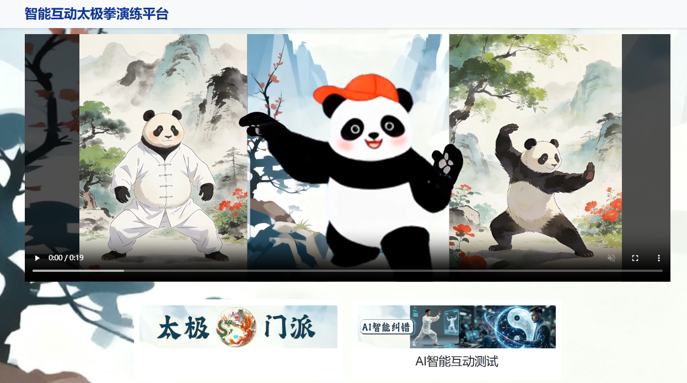
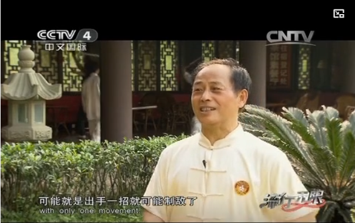
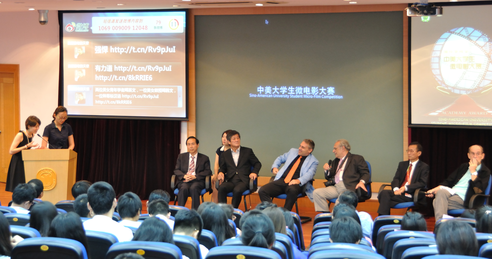
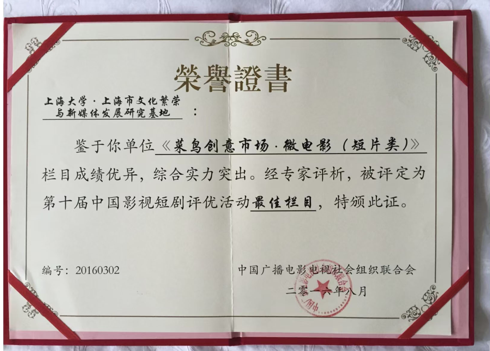

# 智能互动太极拳演练平台 AI Taiji Interactive Practice Platform
## 视频介绍 Video Demo:  视频链接<URL HERE>：https://youtu.be/-ZrvU2QqLWU
## 项目简介 Project Description:
### Part I、价值和意义 Value And Significance 

1. 当今时代，人们对健康养生的关注日益增长。体育运动是人们普遍喜好的健身方式。其中，太极拳运动的演练行云流水，柔中带刚，动作优美，格外受到大众欢迎。太极拳由于在中国传承有相当久远的历史时期，相继形成了杨式、陈式、吴式、武式、孙式等不同风格的流派。为有利于推广太极拳运动并满足现代健身需求，国家体委武术研究院于1996年组织专家创编了28式太极拳。该套路以杨式太极拳为框架，同时吸收陈式、吴式、武式、孙式等流派的技术精华，形成兼具传统武学底蕴与科学健身价值的标准化套路。其创编过程经过严格论证，动作设计符合人体运动规律，易学易练，普遍适合不同年龄层人群学练。国家体委（国家体育总局）还组织专家团队在国内外进行了传授推广。

   Today, people’s attention to health and wellness is growing increasingly. Sports and physical activities are popular ways for people to stay fit. Among these, Tai Ji has gained particular popularity due to its graceful, flowing movements with both tenderness and power, and its beautiful forms. With a long history in China, Tai Ji has developed into several different schools, including Yang, Chen, Wu(As in surname), Wu (As in Wu Shu Martial), and Sun. To promote Tai Ji and meet modern fitness needs, National Sports Commission’s Martial Arts Research Institute organized experts in 1996 to create the 28-Form Tai Ji which incorporating essence from schools of Chen, Wu, Wu, and Sun,based on the Yang's framework to forming a standardized routine that combines traditional martial arts heritage with scientific fitness value. Its creation process has undergone rigorous proof and the movements are designed to follow human biomechanics, making it easy to learn and practice, and suitable for people of all age groups. The National Sports Commission (also referred to as the National Sports Bureaue) also organized experts teams to teach and promote it both domestically and internationally.

2. 太极拳2020年列入联合国教科文组织人类非物质文化遗产代表作名录。现有研究文献表明，太极拳已经传播到全球150多个国家和地区，其中50多个国家和地区建立了太极拳组织， 仅欧洲就有各类太极拳组织30多个，成员达38万。

   Tai Ji has entered UNESCO Representative List of the Intangible Cultural Heritage of Humanity in 2020. Current research indicates that Tai Ji has spread to more than 150 countries and regions worldwide. Among these, over 50 countries and regions have established Tai Ji organizations, with Europe alone hosting more than 30 such organizations, boasting a membership of around 380,000.

3. 2025年11月5日，联合国教科文组织大会第43届会议通过决议，将每年3月21日定为“国际太极拳日”。

   On November 5, 2025, the 43rd session of the UNESCO General Conference adopted a resolution designating March 21 as the International Tai Ji Day annually.

4. 伴随网络自媒体平台的兴起，反映出民众对各种风格流派的太极拳都表现出浓厚的兴趣。不少各式风格流派的太极拳名家、历届世界太极拳冠军得主纷纷现场出镜，传授各式拳法精华。

   With the rise of internet self-media, the general public has shown a profound interest in various styles and schools of Tai Ji. Many renowned masters of different Tai Ji schools as well as former world Tai Ji champions have appeared on media to share the essence of diversfied routines.

5. 为有利于广大民众追随不同风格名家流派学练太极拳，故建此“智能互动太极拳演练平台”，便于习练者打开手机、亦或电脑、电视，参照经典，精益求精，不断总结心得体会，梦虽遥，追则能达，以达日益精进的境界。

   To facilitate the public to learn and practice Tai Ji under the guidance of masters from various schools, we have developed this AI Taiji Interactive Practice Platform. It allows practitioners to easily access the platform via mobile phones, computers, or smart TVs to view classic and standard Taiji demonstrations and improve their Tai Ji performance for perfection. By continuously reflecting on practices and reviews, people will realize that although a dream of being a Tai Ji master is distant, it can be reached through persistent pursuit and  attaining a state of continuous refinement.

### Part II 平台实际操作应用说明 Web Application Instructions
  
 智能互动太极演练平台包括两大模块：太极门派和AI智能互动测试

    
 AI Taiji Interactive Practice Platform includes two modules:Taiji Branches & AI Interactive Test
    

   

1. 太极门派 Taiji Branches

   包括杨、陈、孙、吴、武等代表性门派的演示视频以及为有利于推广太极拳运动并满足现代健身需求，国家体委武术研究院于1996年组织专家创编的28式太极拳标准演练视频
   
   This part includes demonstration videos of representative schools such as Yang, Chen, Sun, Wú, and Wǔ, as well as the 28-Form Tai Ji created by the National Sports Commission Martial Art Research Institute who organizing experts to carry out the programe in 1996 to promote Tai Ji practice and meet modern fitness needs.   
   

2. AI智能互动测试模块，依次分为三个部分：
   AI intelligent interactive test module, which is  divided into three parts in sequence:
   
   （1）自我对照测试：把自己的太极练习视频，上传到网站，和标准的太极视频，对比观看自己的不足之处
        Self-Compare Test: Users upload their Tai Ji practice video to compare their poses with the standard Tai Ji video to observe and find their errors and shortcomings

   （2）问答判断测试：网站准备了一些典型的太极招式视频，有错误的也有正确的，用户观看这些视频，判断正误
        Right or Wrong judgment test: The web application has prepared videos of a few typical Tai Ji poses and ask users to watch these videos to judge right or wrong and view the correct poses.

   （3） AI智能测试：用户上传自己的太极演练视频，AI识别追踪用户的动作和变化，并根据AI数据库里的太极动作数据，给出专业的指导意见   
        AI Intelligent Test: Users upload their Tai Ji exercise videos, AI recognizes and tracks users' movements and gives professional guidance based on stardard Tai Ji data in the AI database

### Part III、为什么要做智能互动太极拳演练平台 Why I decide to do the AI Taiji Project

#### 我之所以选择了“智能互动太极拳演练平台”作为课程的实验应用选匙，主要有两个原因：一是有家学渊源。二是自己喜欢。
    The reason I choose AI Smart Taiji Practice Platform as my final project lies in two, one is owing to my family background and the other is out of my interests.

#### 一、家学渊源 Family Background
1. 我外公（吴信训）的亲弟弟吴信良，是中国武术八段（相当于大学教授），是中国峨眉派武术的代表性传承人之一。在四川省体育局的支持下，2010年4月26日，团结四川省内各市、地、州、县的各大武术门派，成立了《峨眉武术联合总会》，出任秘书长和总教练。现任四川道之道峨眉武术研究院院长。

   My maternal grandfather’s younger brother, Mr.Wu Xinliang, holds the rank of Eighth Duan in Chinese Wushu (which is the highest rank in WuShu field). He is one of the chief representative inheritors of Chinese Martial Arts Emei School. With the support of Sichuan Provincial Sports Bureau, he founded Emei Martial Arts Federation on April 26, 2010, uniting major martial arts schools from various cities, prefectures, and counties across Sichuan Province and served as the Secretary-General and Chief Coach. He is currently the President of  Sichuan the Dao of Dao Emei Martial Arts Research Institute.

   他曾获新中国建国以来，全国规模最大的民间传统武术比赛-全国武术观摩邀请大会：1979年通臂拳銀牌（广西南宁），1980年醉拳金牌（山西太原），1991年醉剑金牌（辽宁沈阳）。

   He has won Silver Medal of Tongbi Quan in 1979 (Nanning, Guangxi), Gold Medal of Drunken Fist in 1980 (Taiyuan, Shanxi), Gold Medal of Drunken Sword in 1991 (Shenyang, Liaoning) at National Wushu Observation and Invitation Conference, the largest folk traditional wushu competition in China since the founding of New China.

   

      
      
峨眉武术名师吴信良

      
Emei Wushu Master Wu Xinliang

    

    

   吴信良先生是四川省首任散打教练。历任四川省武术散打锦标赛总裁判长。曾任全国散打锦标赛裁判长、副总裁判长。培养的散打运动员获全国或省级各级别冠亚军数十人。

   Mr. Wu Xinliang was the first-ever sanda (namely free-fight) coach of Sichuan Province. He has successively served as the Chief Referee for the Sichuan Provincial Wushu Sanda Championships, and previously held the positions of Deputy Chief Referee and Chief Referee  for the National Sanda Championships. He has trained dozens of Sanda athletes who have won championships and runner-up titles at national and provincial levels.

   
   
峨眉武术名师吴信良为央视录制武术实战技巧

    
Emei martial arts master Wu Xinliang records actual combat stunts for CCTV
   

   
   吴信良先生出版有《峨眉散打术》（四川科技出版社，1985）、《实用女子防卫术》（四川科技出版社，1986）《醉拳、醉剑、醉棍》（四川科技出版社，1997）、《实用防身秘术》（北京体育大学出版社，1992）、《世界搏击精萃》（四川人民出版社，1996）、《实战拿法招招绝》（北京体育大学出版社，1999）等18部个人专著。

   Mr. Wu Xinliang has authored 18 personal monographs, including *Emei Sanda Techniques* (Sichuan Science and Technology Press, 1985), *Practical Women’s Self-Defense* (Sichuan Science and Technology Press, 1986), *World Martial Arts Essentials* (Sichuan People’s Publishing House, 1996), *Practical Secret Self-Defense Techniques* (Beijing Sport University Press, 1992), *Drunken Fist, Drunken Sword, and Drunken Cudgel* (Sichuan Science and Technology Press, 1997), and *Invincible Grappling Techniques in Real Combat* (Beijing Sport University Press, 1999).

   他参加了编写中国武术协会段位制教程、四川省武术协会《峨眉武术段位制教程》等。

   He participated in the compilation of the grading system textbooks for the Chinese Wushu Association, as well as the *Emei Wushu Grading System Textbook* for the Sichuan Wushu Association.

   吴信良先生还担任了多部电影电视剧片的武打设计。示范出版了多集武术教学片。如，由中国人民体育音像出版社出版发行的中华武术展现工程《峨眉武术系列片》17集等。

   Additionally, Mr.Wu Xinliang served as the action choreographer for multiple films and television series, and demonstrated and produced several volumes of Wushu instructional videos. Notable examples include the 17-episode *Emei Wushu Series*, which was published and distributed by the China Sports Audio-Visual Publishing House as part of the “Chinese Wushu Showcase Project.”

   他曾多次受到中央电视台、省级电视台的采访报道。被四川警察学院聘为特聘教授，讲授《擒敌格斗》课程。

   He has been interviewed and featured by CCTV and various provincial television stations. Furthermore, he was appointed as a Distinguished Professor at the Sichuan Police College, where he taught the *Enemy Subduing and Combat* course.

   近年来，作为四川省老年体协太极拳剑专委会的副会长兼传统武术委员会主任，成功组织了多届太极拳推广学习班及太极推手学习班，学习人数达数千人。

   In recent years, serving as the Vice President of the Tai Ji Chuan and Sword Special Committee, as well as the Director of the Traditional Wushu Committee under the Sichuan Senior Sports Association, he has successfully organized multiple sessions of Tai Ji Chuan promotion classes and Tai Ji Push Hands training camps, attracting thousands of participants.

   我外公吴信训是上海大学新闻传播学院教授、经济学博士、博士生导师。研究方向：广播电视与新媒体，新媒体与社会发展。

   My grandfather Wu Xinxun is a professor, doctor of economics, and doctoral supervisor at the School of Journalism and Communication of Shanghai University with research directions major in radio, television and new media as well as new media and social development.

   
   
吴信训教授主持首届中美大学生微电影大赛(左一）

    
Professor Wu Xinxun presided over the first Sino-US College student Micro Film Competition (first from left)
   

   他曾是四川大学文学与新闻学院副院长，2002年应聘引进到上海大学。外公在20世纪80年代中期、90年代初期两次赴日本上智大学新闻系、东京大学新闻研究所（社会信息研究所）留学研究。对新媒体发展非常关注，较早就带领团队开展新媒体研究，并有创建网络平台的实践经验。他主持领导创建的《菜鸟创意市场-微电影（短片类）》在第十届中国影视短剧评优活动中被评为“最佳栏目”（由“中国广播电影电视社会组织联合会”颁发荣誉证书）。

   Prof. Wu Xinxun has been introduced to Shanghai University in 2002, before that he was the vice president of the School of Literature and Journalism of Sichuan University. He had carried out research work with the Department of Journalism of Sophia University and the Institute of Journalism (Institute of Social Informatics) of Tokyo University in the mid-80s and early 90s of the 20th century. He is very concerned about the development of new media and has led his team to carry out cutting-edge new media research. Prof.Wu has abundant practical experience in managing new media web platforms and has established several web flatforms for diversified goals of either academic reaseach or education practice. His web project Ideayes Creation Market which is established as a web platform for Chinese college students major in arts,design and mass media showcasing their creation artworks with its Micro Film Category rated as the "Best Column" in the 10th China Film and Television Short Drama Evaluation Activity and awarded an honorary certificate by the "China Federation of Radio, Film and Television Social Organizations Union".

   
   
《菜鸟创意市场-微电影（短片类）》在第十届中国影视短剧评优活动中被评为“最佳栏目”

    
Ideayes Micro Film Category awarded "Best Column" in 10th China Film and Television Short Drama Evaluation Activity 
   

    
   我的外公因受弟弟影响，也对武术长期抱有兴趣，并一直坚持武术、太极拳锻炼。早年曾同弟弟合作撰写出版了《峨眉散打术》、《实用女子防卫术》。2010年7月，他应邀出席在上海体育大学举行的“第十届上海国际武术博览会学术报告会暨第二届申江国际武术论坛”，从一个传播学者的视角，作了一个《武术国际传播的新思路-以武术养生文化的国际传播为切入点》的主题演讲，引起热烈的反响及认同。后来，他在指导一位获得上海体育大学武术学院博士学位的学生从事博士后研究时，就指导该生以此为选题方向，成功申报了国家博士后基金项目。并在博士后出站报告基础上加以修改，正式出版了《武术养生文化国际传播研究》（中国书籍出版社，2015）。

   With the influence of his younger brother Wu Xinliang, Professor Wu has a long-term interest in martial arts, and insists on martial arts and Tai Ji exercises.In his early years, he co-wrote and co-published "Emei Sanda Technique" and "Practical Women's Defense Technique" with his younger brother Mr. Wu Xinliang.In July 2010, he was invited to attend the “Academic Report of the 10th Shanghai International Martial Arts Expo and the Second Shenjiang International Martial Arts Forum” held at Shanghai University of Physical Education. From the perspective of a communication scholar, he gave a keynote speech on "New Ideas for the International Communication of Martial Arts-Taking the International Communication of Martial Arts Health Cultures as the Cutting-In Point", which arrouse warm responses and general recognition.Later, when he guided a post-doctoral student who received his doctorate degree from the School of Martial Arts of Shanghai University of Physical Education to engage the theme of Prof.wu's speech into his postdoctoral research to successfully apply for the National Postdoctoral Fund project.And later revised on the basis of the postdoctoral outbound report, The Postdoctoral fellow officially published "Research on the International Communication of Martial Arts Health Culture" (China Books Press, 2015).

#### 二、因为个人爱好 Out of Personal Interests    

   我对瑜伽和太极拳运动一直都比较有兴趣，经常都会花些时间讲行锻炼。对瑜伽的锻炼，主要是跟着电视上录制播放的视频锻炼。对太极拳的锻炼，则主要是跟着母亲锻炼，或外公在成都时给予指导，或参看外公转发的一些太极拳名家的短视频学习。如：“沅芷教太极-收藏学起来吧…等”、“刘莹教太极-基地教学：陈氏十三式…等”、“诩小侠-《太极十三式》”、“国术太极凌霄龙-陈氏太极拳八法”、“陈氏太极养生营”、“乙青徽卿.太极-太极拳十大口诀”、“太极师姐武敏-太极八法”……等。

   I have been interested in yoga and Tai Ji, and spend a few time practicing both. I used to play yoga following video programs. As of Tai Ji, mum would like to give me some demonstrations and advices. When my grandfather is in Chengdu, he would also give me a few guidance and instructions to help me improve my taiji practice. My grandfather often share me with short videos of internet Tai Ji celebrities such as Yuan Zhi Teaches Tai Ji, Liu Ying Teaches Tai Ji-Chen's Thirteen Poses, Xu Xiaoxia-Taiji Thirteen Poses,  Lingxiaolong-Chen's Eight TaiJi Poses, Chen's TaiJi Health Camp, Yiqing Huiqing Tai Ji Ten Keys, Wu Min-Taiji Eight Methods,etc.

   2026年，中国教育部新增太极拳专业，纳入2026年高考招生，河南理工大学成为首个拥有太极拳本科专业的高校，我希望我们的智能互动太极拳演练平台，也能为太极拳教育事业添砖加瓦，锦上添花。

   In 2026, China's Ministry of Education adds a new Taijiquan major to be included in the 2026 college entrance exam enrollment, and Henan Polytechnic University became the first university with a taijiquan undergraduate major, and I hope the AI Taiji Interactive Practice Platform will be of meaningful and valuable to taijiquan education cause.
  
 ### Part IV、技术路径说明 Technologies used

1. 智能互动太极拳演练平台是一个基于Web的智能太极辅助练习应用。

   The AI Interactive Tai Ji Practice Platform is a web-based intelligent Tai Ji assisted training application.

2. 技术栈： JavaScript (前端交互) + Python (Flask/Django后端及AI算法) + SQL (数据管理)

   Technology Stack: JavaScript (front-end interaction) + Python (Flask/Django back-end and AI algorithms) + SQL (data management)

   (1) 前端使用 JavaScript 实现流畅的用户交互与动作引导界面；

   The front-end utilizes JavaScript to deliver a smooth user interaction and motion-guided interface;

   (2) 后端采用 Python 和 SQL 管理项目资源，为用户提供个性化的太极学习体验；

   The back-end employs Python and SQL to manage project resources, providing users with a personalized Tai Ji learning experience.

